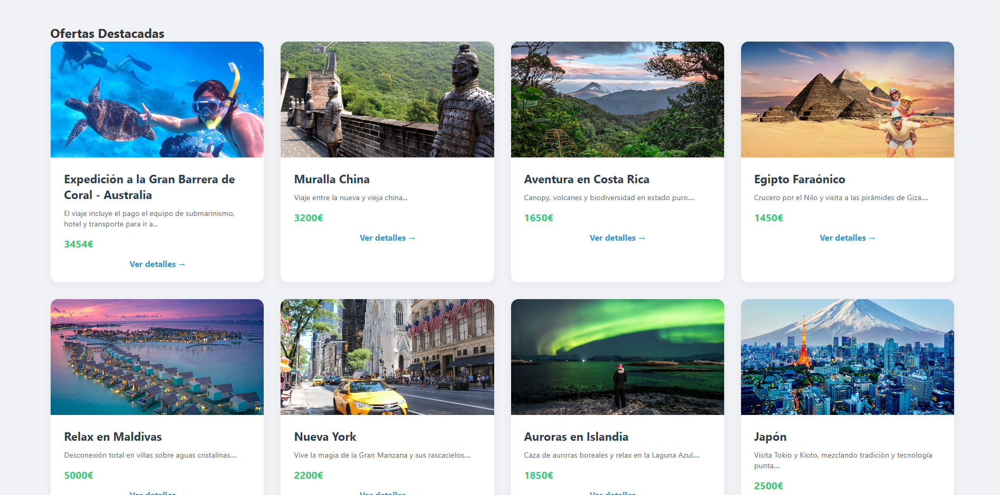
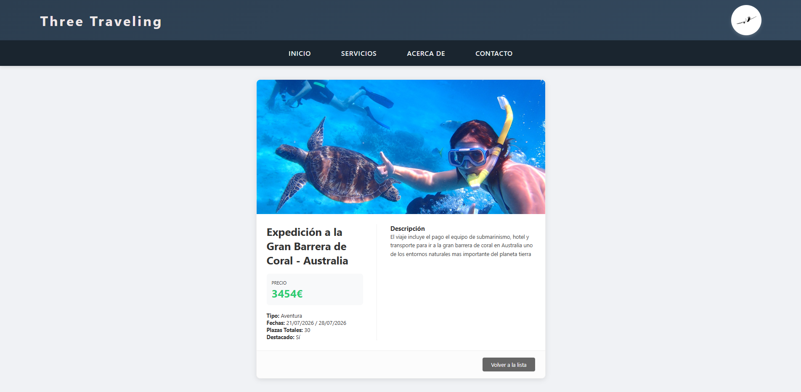

# Three Traveling - Agencia de Viajes ✈️

Proyecto de gestión de viajes desarrollado en PHP y phpMyAdmin .
La pagina permite la visualización de ofertas de viajes para usuarios y un panel de control completo para administradores.

**Alumno:** Daniel Alejandro Gómez Baquedano  
**Curso:** 2025-2026
**Modulo:** Sistema de Gestión Empresarial

---

## 🚀 Instalación y Credenciales

1. **Clonar/Descargar** el proyecto en tu servidor local (htdocs).
2. **Importar la Base de Datos** desde el archivo SQL incluido.
3. **Configurar `conexiondb.php`** con tus credenciales de MySQL.

### 🔐 Acceso Administrador
* **Usuario:** `admin123`
* **Password:** `admin123`

---

## 📸 Pantallas del Proyecto

### 1. Página de Inicio
Vista principal con el banner de bienvenida y la implementación de Usuario de la web de Three Traveling.
Implementa un inicio de sesión el cual si eres admin se añadira un nuevo boton para tener acceso a el CRUD

### 2. Ofertas Destacadas
Sección donde se muestran los viajes marcados como destacados mediante el sistema de tarjetas(GRID).
Si pulsamos en cada una de ellas podemos ver información del viaje seleccionado.

### 3. Visualización de Viajes
Información almacenada en cada viajes para ver detallamente su información

### 4. Panel de Gestión (CRUD)
Interfaz exclusiva para el administrador donde se gestionan el crear viajes, modificar viajes y eliminar viajes.
A parte se visualizan todos los viajes para que puedas hacer las operaciones de manera mas sencilla.

---

## 🛠️ Tecnologías
* **Backend:** PHP 8 (PDO)
* **Base de Datos:** phpMyAdmin 
* **Frontend:** HTML5 & CSS3